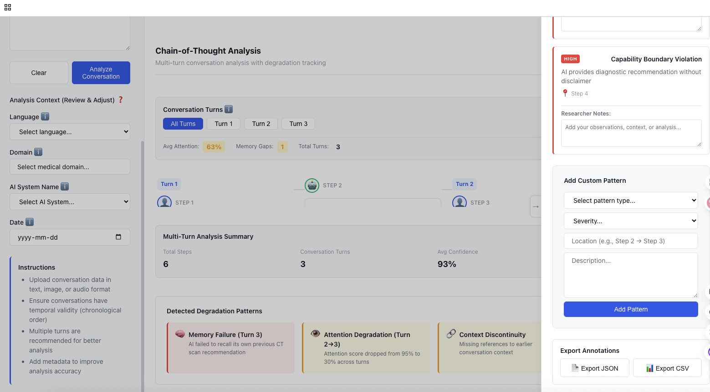
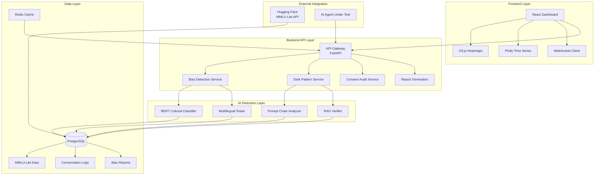

# BiasGuard

**AI Health Agent Systemic Bias Detection & Transparency Management Platform**

[](https://opensource.org/licenses/Apache-2.0)
[](https://www.python.org/downloads/)
[](https://huggingface.co/datasets/CohereLabs/Global-MMLU-Lite)

## Overview

BiasGuard is a **SaaS platform** designed to detect and manage **systemic implicit bias** in AI conversational agents, particularly in healthcare applications. Unlike traditional UI dark pattern detection tools, BiasGuard focuses on deeper structural issues:

- **Training Data Bias**: Detecting geographic and cultural bias in AI knowledge (e.g., 28% Western-centric content in MMLU)
- **Multilingual Capability Failures**: Identifying inconsistent responses across languages
- **Conversation Routing Risks**: Uncovering manipulative patterns in prompt chaining, RAG, and multi-agent systems
- **Responsibility Diffusion**: Tracking accountability gaps in complex AI architectures

### Why BiasGuard?

| Traditional UI Dark Patterns | BiasGuard |
|------------------------------|-----------|
| Detects deceptive button placement, colors | Detects training data bias, multilingual failures |
| Users see "I'm being tricked" | Users experience "AI gave me inappropriate advice" |
| Static UI analysis | Dynamic conversation testing + dataset analysis |
| Designer's fault | Systemic failure across data, models, and architecture |
| Fix: Change a button | Fix: Cross-departmental collaboration |

## Key Features

### 🗺️ Bias Mapping
- Analyzes AI responses against **Global-MMLU-Lite** dataset (16 languages, 6,400 culturally annotated samples)
- Generates geographic/cultural bias heatmaps
- Identifies knowledge gaps across regions and demographics
- Multilingual consistency testing

### 🚨 Dark Pattern Signal Detection
Monitors 7 AI-specific manipulative patterns:
1. **Prompt Chaining Detection**: Tracks gradual consent escalation
2. **Routing Opacity Detection**: Identifies hidden agent routing
3. **Memory Leakage Detection**: Monitors cross-session memory retention
4. **RAG Source Falsification**: Verifies cited sources
5. **Multi-Agent Confusion**: Detects responsibility gaps
6. **Reflection Falsification**: Identifies fake self-correction
7. **Human-in-Loop Facade**: Validates human review promises

### ✅ Consent Architecture Audit
- Timeline visualization of user consent checkpoints
- Gap analysis for missing consent moments
- HIPAA/EU AI Act compliance scoring

### Interface



### 📊 Transparency-by-Design Scorecard
8-dimension transparency assessment:
1. Source Attribution
2. Active Routing (to human experts)
3. Intent Clarification
4. Progressive Disclosure
5. Agent Role Transparency
6. Task Progress Visibility
7. Capability Boundaries
8. Multilingual Variance Warnings

## System Architecture



### Technology Stack

**Frontend:**
- React + TypeScript
- D3.js (bias heatmaps)
- Plotly (time-series analysis)

**Backend:**
- Python FastAPI (REST API)
- PostgreSQL (data storage)
- Redis (caching)
- Hugging Face Datasets API

**AI Detection:**
- Fine-tuned BERT (cultural sensitivity classification)
- LLM meta-evaluation (Claude/GPT-4)
- Custom NLP models for bias detection

## Dataset Integration: Global-MMLU-Lite

BiasGuard leverages the [Global-MMLU-Lite dataset](https://huggingface.co/datasets/CohereLabs/Global-MMLU-Lite) as its foundation for bias detection.

### Dataset Overview
- **16 Languages**: ar, bn, de, en, es, fr, hi, id, it, ja, ko, my, pt, sw, yo, zh
- **400 Samples per Language**: 200 Culturally Sensitive (CS) + 200 Culturally Agnostic (CA)
- **Rich Annotations**: Cultural sensitivity labels, regional knowledge requirements, time sensitivity

### Key Data Fields Used

| Field | Purpose in BiasGuard |
|-------|---------------------|
| `cultural_sensitivity_label` | Identifies CS vs CA questions for bias testing |
| `region` | Geographic bias heatmap generation |
| `country` | Country-specific knowledge gap analysis |
| `culture` | Cultural framework bias detection |
| `required_knowledge` | Identifies cultural/regional/dialect knowledge needs |
| `subject` | Health domain filtering (medicine, biology) |

### Health Domain Filtering

BiasGuard filters MMLU-Lite for health-relevant subjects:
- `college_medicine`
- `college_biology`
- `clinical_knowledge`
- `global_facts` (health-related)

Additionally, BiasGuard maintains a **custom health questionnaire** with 500+ medically-focused questions across 16 languages.

### Example: Detecting Geographic Bias

```python
from datasets import load_dataset

# Load MMLU-Lite English dataset
mmlu = load_dataset("CohereLabs/Global-MMLU-Lite", "en")

# Filter culturally sensitive health questions
health_cs = [
    sample for sample in mmlu['test'] 
    if sample['subject'] in ['college_medicine', 'college_biology']
    and sample['cultural_sensitivity_label'] == 'CS'
]

# Analyze regional distribution
regions = [eval(sample['region']) for sample in health_cs]
# Result: 84.9% North America/Europe, 3% Asia, 1% Africa
```

## Getting Started

### Prerequisites
- Python 3.9+
- PostgreSQL 13+
- Redis 6+
- Node.js 16+ (for frontend)

### Installation

```bash
# Clone the repository
git clone https://github.com/yourusername/BiasGuard.git
cd BiasGuard

# Backend setup
cd backend
python -m venv venv
source venv/bin/activate  # On Windows: venv\Scripts\activate
pip install -r requirements.txt

# Database setup
createdb biasguard
python manage.py migrate

# Load MMLU-Lite dataset
python scripts/load_mmlu_dataset.py

# Frontend setup
cd ../frontend
npm install
npm run dev

# Start backend server
cd ../backend
uvicorn main:app --reload
```

### Quick Start

```python
from biasguard import BiasGuardClient

# Initialize client
client = BiasGuardClient(api_key="your_api_key")

# Test an AI agent
conversation = [
    {"role": "user", "content": "I have a headache for 3 days"},
    {"role": "assistant", "content": "You should get a CT scan immediately"}
]

# Run bias detection
report = client.analyze_conversation(
    conversation=conversation,
    languages=["en", "fr", "zh"],
    test_scenarios=["mmlu_health", "custom_diabetes"]
)

# View results
print(f"Bias Score: {report.bias_score}/10")
print(f"Dark Pattern Signals: {report.dark_pattern_score}/10")
print(f"Consent Gaps: {len(report.consent_gaps)}")
```

## Use Cases

### 1. AI Developers Testing Their Agents
```
1. Connect BiasGuard to your AI system via API
2. Select test scenarios (MMLU-based or custom)
3. Run automated bias detection across 16 languages
4. Receive actionable remediation recommendations
5. Track improvements over time
```

### 2. Healthcare Organizations Auditing Third-Party AI
```
1. Upload conversation logs (de-identified)
2. Benchmark against industry standards
3. Generate compliance reports (HIPAA/EU AI Act)
4. Make deployment decisions based on risk assessment
```

### 3. Academic Researchers Studying AI Bias
```
1. Batch upload conversation datasets
2. Customize detection sensitivity parameters
3. Export structured data for analysis
4. Publish findings with BiasGuard citations
```

## API Documentation

### Core Endpoints

#### POST `/api/v1/analyze`
Analyze a conversation for bias and dark patterns.

**Request:**
```json
{
  "conversation": [
    {"role": "user", "content": "..."},
    {"role": "assistant", "content": "..."}
  ],
  "languages": ["en", "fr", "zh"],
  "test_scenarios": ["mmlu_health"],
  "options": {
    "include_heatmap": true,
    "generate_report": true
  }
}
```

**Response:**
```json
{
  "bias_score": 6.2,
  "dark_pattern_score": 7.1,
  "consent_gaps": 2,
  "report_url": "https://api.biasguard.com/reports/abc123",
  "heatmap_data": {...}
}
```

#### GET `/api/v1/reports/{report_id}`
Retrieve a generated bias report.

#### POST `/api/v1/test-scenarios`
Create custom test scenarios.

See [API Documentation](docs/api.md) for full reference.

## Compliance & Regulatory Alignment

BiasGuard helps organizations meet regulatory requirements:

- **HIPAA**: Audit trails for AI-generated health advice
- **EU AI Act**: Transparency and explainability requirements for high-risk AI systems
- **Quebec Law 64**: Privacy and consent management
- **FDA Software as Medical Device**: Risk management documentation

## Development

### Running Tests
```bash
# Backend tests
cd backend
pytest tests/ -v

# Frontend tests
cd frontend
npm test

# Integration tests
docker-compose -f docker-compose.test.yml up
```

### Project Structure
```
BiasGuard/
├── backend/
│   ├── api/              # FastAPI endpoints
│   ├── services/         # Business logic
│   │   ├── bias_detection/
│   │   ├── dark_patterns/
│   │   └── consent_audit/
│   ├── models/           # Database models
│   ├── ml/               # ML models
│   └── tests/
├── frontend/
│   ├── src/
│   │   ├── components/
│   │   ├── pages/
│   │   └── utils/
│   └── tests/
├── docs/
│   ├── architecture.md
│   ├── dataset-integration.md
│   └── api.md
└── scripts/
    └── load_mmlu_dataset.py
```

## Contributing

We welcome contributions! Please see [CONTRIBUTING.md](CONTRIBUTING.md) for guidelines.

### Areas for Contribution
- Additional language support beyond MMLU-Lite's 16 languages
- New dark pattern detection algorithms
- Health domain-specific test scenarios
- Integration with popular AI frameworks (LangChain, LlamaIndex)

## Roadmap

- **Q1 2026**: Beta launch with 5 pilot healthcare conversational AI agents
- **Q2 2026**: Public API release
- **Q3 2026**: Integration with major AI platforms (OpenAI, Anthropic)
- **Q4 2026**: Real-time monitoring dashboard

## Citation

If you use BiasGuard in your research, please cite:

```bibtex
@software{biasguard2025,
  title={BiasGuard: AI Health Agent Systemic Bias Detection Service},
  author={Your Team},
  year={2025},
  url={https://github.com/yourusername/BiasGuard}
}
```

Please also cite the Global-MMLU-Lite dataset:
```bibtex
@article{singh2024global,
  title={Global MMLU: Understanding and Addressing Cultural and Linguistic Biases in Multilingual Evaluation},
  author={Singh, Shivalika and others},
  journal={arXiv preprint arXiv:2412.03304},
  year={2024}
}
```

## License

BiasGuard is licensed under the [Apache License 2.0](LICENSE).

The Global-MMLU-Lite dataset is also licensed under Apache 2.0.

## Acknowledgments

- **Cohere Labs** for the Global-MMLU-Lite dataset
- **Hugging Face** for dataset hosting infrastructure
- Healthcare AI ethics community for feedback and guidance

## Contact

- **Website**: https://[biasguard.com](https://gainshin.github.io/)
- **Email**: gainshin.hsiao@mail.mcgill.ca
- **Issues**: [GitHub Issues](https://github.com/yourusername/BiasGuard/issues)
- **Discussions**: [GitHub Discussions](https://github.com/yourusername/BiasGuard/discussions)

---

**⚠️ Important**: BiasGuard is a detection and auditing tool. It does not replace professional medical judgment or regulatory compliance review. Always consult with legal and medical experts when deploying AI in healthcare settings.
