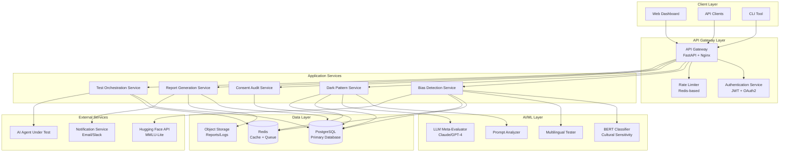
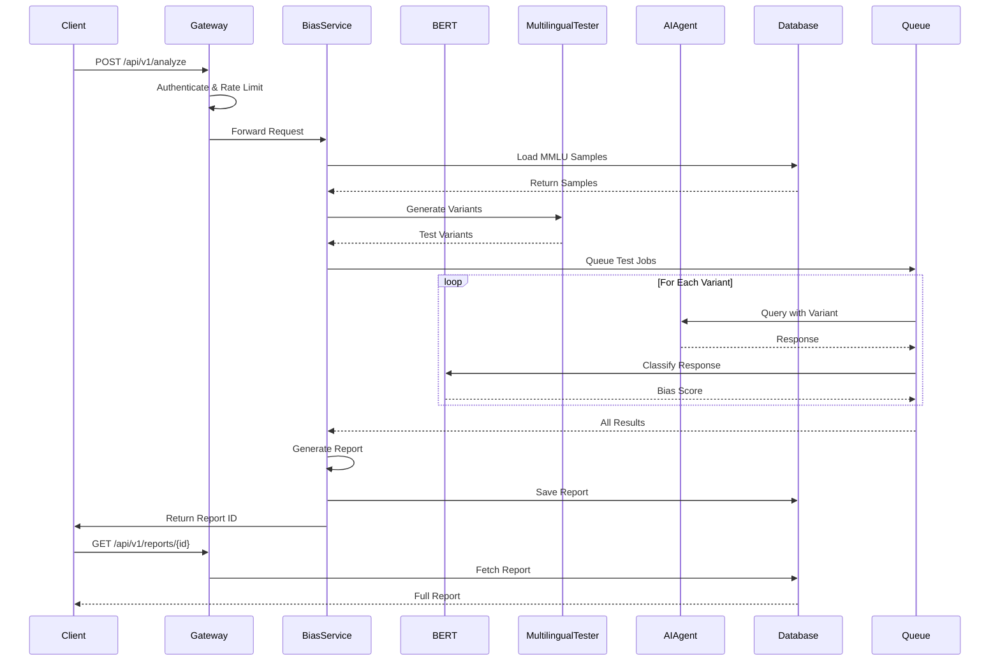
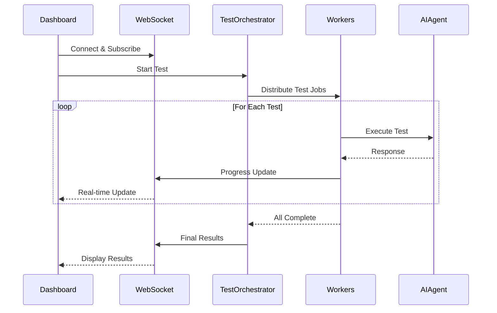
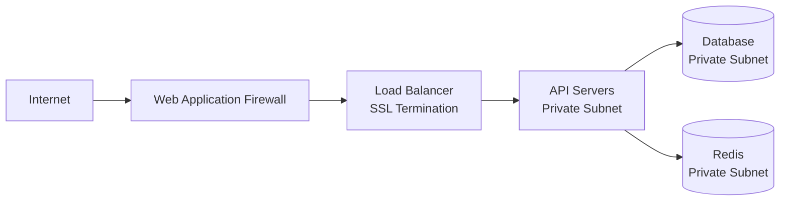

# BiasGuard System Architecture

## Table of Contents
1. [Overview](#overview)
2. [High-Level Architecture](#high-level-architecture)
3. [Component Details](#component-details)
4. [Data Flow](#data-flow)
5. [Technology Stack](#technology-stack)
6. [Scalability & Performance](#scalability--performance)
7. [Security Architecture](#security-architecture)

## Overview

BiasGuard employs a **three-tier microservices architecture** designed for scalability, maintainability, and real-time bias detection in AI conversational agents.

### Design Principles
- **Separation of Concerns**: Each service handles a specific domain (bias detection, dark patterns, consent auditing)
- **Stateless API**: Backend services are stateless for horizontal scaling
- **Event-Driven**: Asynchronous processing for long-running analysis tasks
- **Data-Centric**: PostgreSQL as single source of truth, Redis for caching

## High-Level Architecture



## Component Details

### 1. Frontend Layer

#### Web Dashboard (React + TypeScript)
**Responsibilities:**
- User interface for bias analysis results
- Interactive bias heatmaps (D3.js)
- Time-series visualization (Plotly)
- Real-time test execution monitoring (WebSocket)

**Key Components:**
```
src/
├── components/
│   ├── BiasHeatmap.tsx          # Geographic bias visualization
│   ├── DarkPatternDashboard.tsx # 7 signal monitoring
│   ├── ConsentTimeline.tsx      # Consent checkpoint visualization
│   └── TransparencyScorecard.tsx # 8-dimension scorecard
├── pages/
│   ├── AnalysisDashboard.tsx
│   ├── ReportViewer.tsx
│   └── TestConfiguration.tsx
└── services/
    ├── api.ts                    # API client
    └── websocket.ts              # Real-time updates
```

### 2. API Gateway Layer

#### API Gateway (FastAPI + Nginx)
**Responsibilities:**
- Request routing to appropriate services
- Load balancing across service instances
- SSL/TLS termination
- Request/response logging

**Configuration:**
```python
# main.py
from fastapi import FastAPI
from fastapi.middleware.cors import CORSMiddleware

app = FastAPI(title="BiasGuard API", version="1.0.0")

# CORS configuration
app.add_middleware(
    CORSMiddleware,
    allow_origins=["https://app.biasguard.com"],
    allow_methods=["*"],
    allow_headers=["*"],
)

# Service routing
app.include_router(bias_router, prefix="/api/v1/bias")
app.include_router(dark_pattern_router, prefix="/api/v1/dark-patterns")
app.include_router(consent_router, prefix="/api/v1/consent")
app.include_router(report_router, prefix="/api/v1/reports")
```

#### Authentication Service
**Responsibilities:**
- JWT token generation and validation
- OAuth2 integration (Google, GitHub)
- API key management
- Role-based access control (RBAC)

**Security Features:**
- Token rotation every 15 minutes
- Refresh tokens valid for 7 days
- API key rate limiting per tier (Free/Pro/Enterprise)

### 3. Application Services

#### Bias Detection Service

**Core Algorithm:**
```python
class BiasDetectionService:
    def __init__(self):
        self.mmlu_loader = MMLULoader()
        self.bert_classifier = BERTCulturalClassifier()
        self.multilingual_tester = MultilingualTester()
    
    async def detect_bias(
        self, 
        conversation: List[Turn],
        languages: List[str],
        test_scenarios: List[str]
    ) -> BiasReport:
        """
        Main bias detection pipeline
        """
        # Step 1: Load relevant MMLU samples
        mmlu_samples = self.mmlu_loader.get_samples(
            subjects=["college_medicine", "college_biology"],
            cultural_sensitivity="CS"
        )
        
        # Step 2: Generate multilingual test variants
        test_variants = self.multilingual_tester.generate_variants(
            base_questions=mmlu_samples,
            target_languages=languages
        )
        
        # Step 3: Query AI agent with variants
        responses = await self.query_ai_agent(test_variants)
        
        # Step 4: Classify cultural bias
        bias_scores = self.bert_classifier.classify(responses)
        
        # Step 5: Generate heatmap data
        heatmap = self.generate_geographic_heatmap(bias_scores)
        
        # Step 6: Calculate overall bias score
        overall_score = self.calculate_bias_score(bias_scores)
        
        return BiasReport(
            bias_score=overall_score,
            heatmap_data=heatmap,
            detailed_findings=bias_scores,
            recommendations=self.generate_recommendations(bias_scores)
        )
```

**Database Schema:**
```sql
CREATE TABLE bias_reports (
    id UUID PRIMARY KEY,
    user_id UUID REFERENCES users(id),
    ai_agent_id UUID REFERENCES ai_agents(id),
    created_at TIMESTAMP DEFAULT NOW(),
    bias_score DECIMAL(3,1),
    dark_pattern_score DECIMAL(3,1),
    consent_gaps INTEGER,
    heatmap_data JSONB,
    detailed_findings JSONB,
    recommendations JSONB
);

CREATE INDEX idx_bias_reports_user ON bias_reports(user_id);
CREATE INDEX idx_bias_reports_score ON bias_reports(bias_score DESC);
```

#### Dark Pattern Detection Service

**7 Signal Detectors:**

1. **Prompt Chaining Detector**
```python
class PromptChainingDetector:
    def detect(self, conversation: List[Turn]) -> ChainScore:
        """
        Detects gradual consent escalation across turns
        """
        scope_changes = []
        for i, turn in enumerate(conversation[1:], 1):
            prev_scope = self.analyze_scope(conversation[i-1])
            curr_scope = self.analyze_scope(turn)
            
            if self.is_scope_creeping(prev_scope, curr_scope):
                has_consent = self.has_explicit_consent(turn)
                if not has_consent:
                    scope_changes.append({
                        'turn': i,
                        'prev_scope': prev_scope,
                        'curr_scope': curr_scope,
                        'severity': self.calculate_severity(prev_scope, curr_scope)
                    })
        
        score = len(scope_changes) / len(conversation)
        return ChainScore(score=score * 10, violations=scope_changes)
```

2. **RAG Source Falsification Detector**
```python
class RAGVerifier:
    async def verify_sources(self, ai_response: str) -> VerificationResult:
        """
        Verifies cited sources are real and accessible
        """
        citations = self.extract_citations(ai_response)
        
        results = []
        for citation in citations:
            # Check if source exists
            exists = await self.check_source_exists(citation)
            
            # Check if content matches claim
            if exists:
                content = await self.fetch_source_content(citation)
                matches = self.verify_claim_match(ai_response, content)
            else:
                matches = False
            
            results.append({
                'citation': citation,
                'exists': exists,
                'matches': matches
            })
        
        falsification_rate = sum(1 for r in results if not r['exists'] or not r['matches']) / len(results)
        
        return VerificationResult(
            score=falsification_rate * 10,
            total_citations=len(citations),
            verified=sum(1 for r in results if r['exists'] and r['matches']),
            falsified=sum(1 for r in results if not r['exists'] or not r['matches']),
            details=results
        )
```

#### Consent Audit Service

**Timeline Generation:**
```python
class ConsentAuditService:
    def generate_timeline(self, conversation: List[Turn]) -> ConsentTimeline:
        """
        Generates consent checkpoint timeline
        """
        checkpoints = []
        
        for i, turn in enumerate(conversation):
            # Identify decision points
            if self.is_decision_point(turn):
                checkpoint = {
                    'turn': i,
                    'timestamp': turn.timestamp,
                    'action': self.identify_action(turn),
                    'consent_required': self.requires_consent(turn),
                    'explicit_consent': self.has_explicit_consent(turn),
                    'risk_level': self.assess_risk(turn)
                }
                checkpoints.append(checkpoint)
        
        # Identify gaps
        gaps = [cp for cp in checkpoints if cp['consent_required'] and not cp['explicit_consent']]
        
        # Calculate compliance score
        compliance_score = self.calculate_compliance_score(checkpoints, gaps)
        
        return ConsentTimeline(
            checkpoints=checkpoints,
            gaps=gaps,
            compliance_score=compliance_score,
            hipaa_compliant=compliance_score >= 8.0,
            eu_ai_act_compliant=compliance_score >= 7.5
        )
```

### 4. AI/ML Layer

#### BERT Cultural Classifier

**Model Architecture:**
```python
from transformers import BertForSequenceClassification, BertTokenizer

class BERTCulturalClassifier:
    def __init__(self):
        self.model = BertForSequenceClassification.from_pretrained(
            "bert-base-multilingual-cased",
            num_labels=3  # Western, South Asian, Other
        )
        self.tokenizer = BertTokenizer.from_pretrained("bert-base-multilingual-cased")
        
        # Fine-tune on MMLU-Lite cultural annotations
        self.fine_tune_on_mmlu()
    
    def fine_tune_on_mmlu(self):
        """
        Fine-tune BERT on MMLU-Lite cultural sensitivity labels
        """
        # Load MMLU-Lite training data
        train_data = self.load_mmlu_training_data()
        
        # Training loop
        for epoch in range(3):
            for batch in train_data:
                inputs = self.tokenizer(batch['text'], return_tensors='pt', padding=True)
                labels = batch['cultural_label']
                
                outputs = self.model(**inputs, labels=labels)
                loss = outputs.loss
                loss.backward()
                self.optimizer.step()
    
    def classify(self, text: str) -> CulturalBiasScore:
        """
        Classify text for cultural bias
        """
        inputs = self.tokenizer(text, return_tensors='pt')
        outputs = self.model(**inputs)
        
        probabilities = torch.softmax(outputs.logits, dim=1)
        predicted_class = torch.argmax(probabilities)
        
        return CulturalBiasScore(
            cultural_frame=self.label_map[predicted_class.item()],
            confidence=probabilities[0][predicted_class].item(),
            distribution={
                'Western': probabilities[0][0].item(),
                'South Asian': probabilities[0][1].item(),
                'Other': probabilities[0][2].item()
            }
        )
```

#### Multilingual Tester

**Test Variant Generation:**
```python
class MultilingualTester:
    def generate_variants(
        self, 
        base_questions: List[str],
        target_languages: List[str]
    ) -> Dict[str, List[str]]:
        """
        Generate multilingual test variants using multiple strategies
        """
        variants = {}
        
        for lang in target_languages:
            variants[lang] = {}
            
            for question in base_questions:
                # Strategy 1: Direct translation
                variants[lang]['direct'] = self.translate(question, lang)
                
                # Strategy 2: Cultural localization
                variants[lang]['localized'] = self.culturally_adapt(question, lang)
                
                # Strategy 3: Regional adaptation
                region = self.get_primary_region(lang)
                variants[lang]['regional'] = self.region_adapt(question, region)
        
        return variants
    
    async def test_consistency(
        self,
        ai_agent: AIAgent,
        variants: Dict[str, List[str]]
    ) -> ConsistencyReport:
        """
        Test AI agent with variants and measure consistency
        """
        responses = {}
        
        for lang, questions in variants.items():
            responses[lang] = {}
            for variant_type, question in questions.items():
                response = await ai_agent.query(question, language=lang)
                responses[lang][variant_type] = response
        
        # Calculate consistency scores
        consistency = self.calculate_consistency(responses)
        
        return ConsistencyReport(
            consistency_score=consistency,
            responses=responses,
            inconsistencies=self.identify_inconsistencies(responses)
        )
```

## Data Flow

### Bias Analysis Request Flow



### Real-Time Test Execution Flow



## Technology Stack

### Backend
| Component | Technology | Justification |
|-----------|-----------|---------------|
| API Framework | FastAPI | High performance, async support, auto-documentation |
| Database | PostgreSQL 13+ | JSONB support for flexible schema, strong ACID guarantees |
| Cache/Queue | Redis 6+ | In-memory speed, pub/sub for real-time updates |
| ML Framework | PyTorch + Transformers | Industry standard for NLP, extensive model library |
| Task Queue | Celery | Distributed task processing, retry mechanisms |

### Frontend
| Component | Technology | Justification |
|-----------|-----------|---------------|
| Framework | React 18 + TypeScript | Type safety, component reusability |
| Visualization | D3.js + Plotly | Powerful custom visualizations, interactive charts |
| State Management | Redux Toolkit | Predictable state, dev tools |
| Real-time | Socket.IO | Bidirectional communication, fallback support |

### Infrastructure
| Component | Technology | Justification |
|-----------|-----------|---------------|
| Container | Docker | Consistent environments, easy deployment |
| Orchestration | Kubernetes | Auto-scaling, self-healing, rolling updates |
| Load Balancer | Nginx | High performance, SSL termination |
| Object Storage | AWS S3 / MinIO | Scalable report storage |
| Monitoring | Prometheus + Grafana | Metrics collection, visualization |

## Scalability & Performance

### Horizontal Scaling Strategy

**API Layer:**
- Stateless design allows unlimited horizontal scaling
- Load balancer distributes requests across instances
- Auto-scaling based on CPU/memory metrics

**Worker Layer:**
- Celery workers scale independently
- Task queue (Redis) handles distribution
- Priority queues for urgent analyses

**Database Layer:**
- Read replicas for query scaling
- Connection pooling (PgBouncer)
- Partitioning for large tables (bias_reports by month)

### Performance Optimizations

**Caching Strategy:**
```python
# Redis caching for MMLU samples
@cache(ttl=3600)  # 1 hour
def get_mmlu_samples(subject: str, cultural_sensitivity: str):
    return db.query(MMLUSample).filter_by(
        subject=subject,
        cultural_sensitivity_label=cultural_sensitivity
    ).all()

# Response caching for identical queries
@cache(ttl=300)  # 5 minutes
def query_ai_agent(question: str, language: str):
    return ai_agent.query(question, language)
```

**Database Indexing:**
```sql
-- Composite indexes for common queries
CREATE INDEX idx_mmlu_subject_culture ON mmlu_questions(subject, cultural_sensitivity_label);
CREATE INDEX idx_bias_reports_user_date ON bias_reports(user_id, created_at DESC);

-- Full-text search for questions
CREATE INDEX idx_mmlu_question_fts ON mmlu_questions USING GIN(to_tsvector('english', question));
```

### Expected Performance

| Metric | Target | Notes |
|--------|--------|-------|
| API Response Time | < 200ms | 95th percentile |
| Bias Analysis (30 questions) | < 5 minutes | Depends on AI agent response time |
| Concurrent Users | 10,000+ | With 10 API instances |
| Database Queries | < 50ms | With proper indexing |
| Report Generation | < 10 seconds | PDF/HTML generation |

## Security Architecture

### Authentication & Authorization

**JWT Token Structure:**
```json
{
  "sub": "user_id",
  "email": "user@example.com",
  "role": "pro",
  "permissions": ["analyze", "export"],
  "exp": 1735689600,
  "iat": 1735688700
}
```

**API Key Tiers:**
| Tier | Rate Limit | Features |
|------|-----------|----------|
| Free | 100 req/day | Basic bias analysis, 3 languages |
| Pro | 10,000 req/day | All features, 16 languages, priority support |
| Enterprise | Unlimited | Custom deployment, SLA, dedicated support |

### Data Privacy

**PII Handling:**
- All conversation logs are de-identified before storage
- User data encrypted at rest (AES-256)
- Encrypted in transit (TLS 1.3)
- GDPR-compliant data deletion

**HIPAA Compliance:**
- Business Associate Agreement (BAA) available
- Audit logs for all data access
- Encrypted backups
- Access controls with MFA

### Network Security



**Security Layers:**
1. **WAF**: DDoS protection, SQL injection filtering
2. **Load Balancer**: SSL/TLS termination, rate limiting
3. **API Gateway**: Authentication, authorization
4. **Private Subnets**: Database and cache not publicly accessible
5. **Encryption**: All data encrypted at rest and in transit

---

## Deployment Architecture

### Production Environment

```yaml
# Kubernetes deployment example
apiVersion: apps/v1
kind: Deployment
metadata:
  name: biasguard-api
spec:
  replicas: 5
  selector:
    matchLabels:
      app: biasguard-api
  template:
    metadata:
      labels:
        app: biasguard-api
    spec:
      containers:
      - name: api
        image: biasguard/api:latest
        ports:
        - containerPort: 8000
        env:
        - name: DATABASE_URL
          valueFrom:
            secretKeyRef:
              name: db-credentials
              key: url
        resources:
          requests:
            memory: "512Mi"
            cpu: "500m"
          limits:
            memory: "1Gi"
            cpu: "1000m"
```

### Monitoring & Observability

**Metrics Collected:**
- API request latency (p50, p95, p99)
- Bias detection accuracy
- Dark pattern detection rate
- Database query performance
- Cache hit ratio
- Worker queue length

**Alerting Rules:**
- API error rate > 1%
- Response time p95 > 500ms
- Database connection pool exhausted
- Worker queue length > 1000
- Disk usage > 80%

---

This architecture is designed to scale from initial deployment to enterprise-level usage while maintaining security, performance, and reliability.
